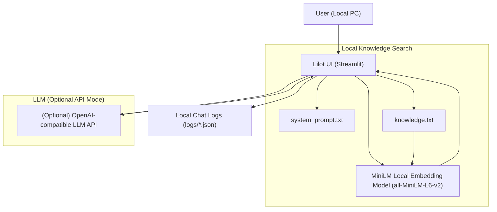

# Locallm  
ローカルナレッジ検索 × LLM 質問アプリ  
（Keyword Search / Embedding Search 対応）

---

## 📌 Overview

**Locallm** は、ローカル PC 内の `knowledge.txt` を検索し、  
必要に応じて任意の LLM（OpenAI / Azure / RakutenAI / OpenAI互換API）へ問い合わせるアプリです。

データはすべてローカルに保存されるため、情報漏えいリスクを最小化できます。  
Embedding 版と Keyword 版の2種類の検索方法を選べます。

初心者でも使いやすいように、**セットアップウィザード（setup.bat）** を用意しています。

---

# 🏗️ Program Specification

## 🧩 System Architecture



---

## ✨ Features

- 🧠 **ローカルナレッジ検索**
  - keyword search（KWM）
  - embedding-based search（ベクトル検索）
- 📄 `knowledge.txt` による FAQ / 業務ナレッジ管理
- 📁 `data/uploads/` へ追加したファイルも検索対象  
  - txt / md：段落ごと  
  - csv：1行＝1ドキュメント
- 💬 LLM問い合わせ  
  - OpenAI / Azure / RakutenAI / 任意の互換API に対応
- 📝 会話ログをローカルに保存（jsonl）
- 🎛️ `system_prompt.txt` による人物設定
- 🧰 “初心者に優しい” セットアップウィザード
- 🔐 ローカル保存でセキュア

---

## 📁 Folder Structure

```
locallm/
├── app/
│   ├── app_kwm.py        # キーワード検索アプリ
│   ├── app_emb.py        # ベクトル検索アプリ
├── data/
│   ├── knowledge.txt     # ナレッジ本文
│   ├── system_prompt.txt # LLMの振る舞い定義
│   ├── uploads/          # ユーザが追加したファイル置き場
├── logs/
│   └── YYYYMMDD_xxx.jsonl    # 会話ログ
├── run_app_kwm.bat       # キーワード検索版起動
├── run_app_emb.bat       # ベクトル検索版起動
├── setup.bat             # セットアップウィザード
├── requirements.txt
└── README.md
```

---

## ⚙️ Technical Specification

| 項目 | 内容 |
|------|------|
| 言語 | Python 3.10+ |
| UI | Streamlit |
| LLM API | OpenAI / Azure / RakutenAI / 他互換API |
| Embedding | 任意の API に差し替え可 (.env で切替) |
| 設定ファイル | `.env` |
| データ保存 | すべてローカル（knowledge.txt / logs） |
| キャッシュ | Streamlit cache_data |

---

## 🧪 Search Logic

### 🔍 Keyword Search（KWM）
1. クエリを簡易トークン化  
2. knowledge.txt / uploads を全文検索  
3. Jaccard + 部分一致ボーナスでスコア  
4. 上位ドキュメントを LLM へ渡す

### 🚀 Embedding Search
1. knowledge.txt を分割  
2. Embedding API（OpenAI / Azure / RakutenAI）でベクトル化  
3. クエリもベクトル化  
4. cosine similarity で類似トップ k を抽出  
5. LLM へ渡す

---

## 🔐 Security Notes（重要）

- LLM への API 呼び出しは **ステートレス**  
  → データの保存・学習には利用されません  
- 保存されるデータは **すべてローカル PC のみ**  
  - knowledge.txt  
  - system_prompt.txt  
  - uploads ファイル  
  - 会話ログ（jsonl）
- .env の API Key はユーザー自身で管理
- 通信は HTTPS による暗号化

---

## 🧑‍💻 Setup Guide

### 1. Miniforge をインストール  
https://github.com/conda-forge/miniforge

デフォルトインストール先：
```
C:\Users\<UserName>\miniforge3
```

### 2. Locallm.zip をダウンロードし、  
```
C:\TMP\
```
に展開してください。

### 3. `setup.bat` を実行  
- Miniforge を自動検出  
- Locallm フォルダを `C:\TMP\Locallm` へ展開  
- Desktop にショートカット作成（kwm / embedding）

### 4. 起動  
デスクトップの以下のショートカットから起動できます。

- **Locallm (Keyword版)**
- **Locallm (Embedding版)**

---

## 📌 Usage

### knowledge.txt を編集すればローカルナレッジが即反映されます。

例：
```
【保険金請求の流れ】
1. 必要書類を提出
2. 受付後、審査が行われます
3. 通常5営業日程度で振込
```

---

## 📝 License

This project is released under the **MIT License**.  
（OSS で最も一般的な自由度の高いライセンスです）

```
MIT License

Copyright (c) 2025

Permission is hereby granted, free of charge, to any person obtaining a copy
...
```

---

## 🙌 Contributing

Pull Request / Issue 大歓迎です！

---

## 📮 Contact

作者：Munehiko Nagase  
コミュニティ：Data Noodle / JTUG / Tableau Manufacturing User Group

