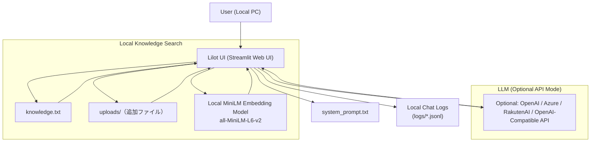

# Lilot  
ローカルナレッジ検索 × ローカル / クラウド LLM  
（Keyword Search / Embedding Search 対応）

---

## 📌 Overview

**Lilot（リロット）** は、ローカル PC に保存したナレッジ (`knowledge.txt` など) を  
**キーワード検索** または **ベクトル検索（MiniLM Embedding）** によって取得し、  
必要に応じて **OpenAI / Azure / RakutenAI / OpenAI互換API** の LLM に渡して回答を生成するアプリです。

- データはすべてローカル保存 → **情報漏えいリスク最小化**
- MiniLM ローカルモデル同梱 → **Embedding 検索がオフライン動作**
- setup.bat による完全自動セットアップ → **初心者でも簡単**
- 個人用ナレッジ管理から企業 FAQ システムまで幅広く対応

---

# 🏗️ System Architecture



# ✨ Features
🔍 ローカル検索

キーワード検索（Keyword Search）

Embedding検索（MiniLM-L6-v2 ローカル動作）

# 🧠 LLM連携（任意）
OpenAI
Azure OpenAI
任意の OpenAI 互換 API
（例：self-hosted LM Studio、LocalAI など）

# 📂 ナレッジ管理
knowledge.txt を編集するだけで即反映
uploads/ 下の txt / md / csv も自動で検索対象

# 💾 完全ローカル保存
ナレッジファイル
system_prompt.txt
会話ログ
アップロードファイル
→ 外部に送信されるのは LLM に渡す上位数文のみ

# 🛡️ 高いセキュリティ
Embedding はローカルモデル → 外部送信ゼロ
通信は HTTPS（API 利用時）
セッションはステートレス（API 側にログは残らない）

# 💻 簡単セットアップ
setup.bat を実行するだけ
（Miniforge 検出 → パッケージインストール → ショートカット作成）

# 📁 Folder Structure
```
lilot/
├── app/
│   ├── app_kwm.py                # キーワード検索版
│   ├── app_emb.py                # Embedding検索版
├── data/
│   ├── knowledge.txt             # ローカルナレッジ
│   ├── system_prompt.txt         # LLM振る舞い設定
│   └── uploads/                  # 追加ファイル
├── models/
│   └── all-MiniLM-L6-v2/         # ローカルEmbeddingモデル
├── logs/
│   └── YYYYMMDD_xxx.jsonl        # チャットログ
├── run_app_kwm.bat               # キーワード検索版起動
├── run_app_emb.bat               # Embedding検索版起動
├── install_requirements_conda.bat
├── setup.bat
├── requirements.txt
└── README.md
```

# 🔧 Technical Specification
項目	内容
------------------
言語	Python 3.10+
UI	Streamlit
検索方式	Keyword / Embedding
Embedding	MiniLM-L6-v2（ローカル埋め込みモデル）
LLM API	OpenAI / Azure / OpenAI互換API
設定	.env に API情報を記述（未設定ならローカルのみで動作）
保存	すべてローカル保存
キャッシュ	Streamlit cache_data

# 🔍 Search Logic
Keyword Search（KWM）

クエリを簡易トークン化

knowledge.txt / uploads を全文検索

Jaccard + ボーナススコア

上位文を LLM へ渡す（任意）

Embedding Search（MiniLM）

knowledge.txt を段落に分割

MiniLM-L6-v2（ローカル）でベクトル化

cosine 類似度で類似上位文抽出

必要に応じて LLM へ渡す

# 🔐 Security Notes

LLM API は ステートレス
→ 質問・コンテキストが「学習」されたりサーバに保存されることはない

knowledge.txt / uploads / logs はすべて ローカルのみ

API利用時も送信されるのは 上位数文のみ

# 🧑‍💻 Setup Guide
1. Miniforge をインストール

https://github.com/conda-forge/miniforge

2. lilot.zip を任意のフォルダに展開
3. setup.bat を実行

Miniforge 自動検出

必要モジュールインストール

Desktop にショートカット作成

4. 起動

Lilot (Keyword Search)

Lilot (Embedding Search)

# 📌 Usage Example

knowledge.txt を書き換えるだけで検索結果に反映されます。

【保険金請求の流れ】
1. 必要書類を提出
2. 審査が行われる
3. 通常5営業日以内に振込

# 📝 License (MIT)

MIT License
Copyright (c) 2025

```
